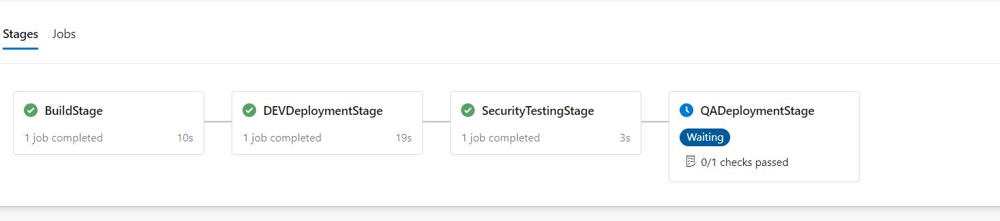

# Azure Pipelines Environment Demo.

Azure Pipelines have feature "Environment" I could not find a neat example anywhere 

I have modeled Azure Pipeline with following features

+ Submodules
+ Multiple Stages
+ Environment Deployment based success of stage 

Success / Failures are generated based on a random number.

You can do Gating / Approval in your azure devops environment.

